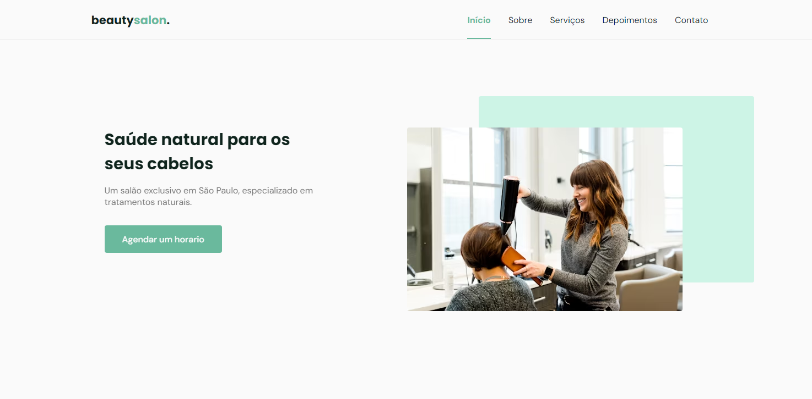

# NLW #06 - Origin

- Este é um conteúdo da Next Level Week Together, apresentado entre 20 e 27 de junho de 2021.

> BeautySalão - OriginSix

Foi desenvolvido o projeto OriginSix, uma página institucional no formato One Page, responsiva.
O layout foi desenvolvido para o salão de beleza BeautySalon,
mas pode ser adaptado para diversos tipos de micro, pequenas e médias empresas.

## 🔗 Deploy 

👉🏼[Link do projeto](https://nlw-6-beauty-salon.netlify.app/)

## Tecnologias

## Biblioteca swiper para montar o slider / carousel

https://swiperjs.com/get-started

## Enviar mensagem via whatssap usando api de whatssap

https://api.whatsapp.com/send?phone=+5542999280298&text=

# Biblioteca para colocar animação no scroll review

https://scrollrevealjs.org/

## 🔗 Deploy

## 🔗 My Links

